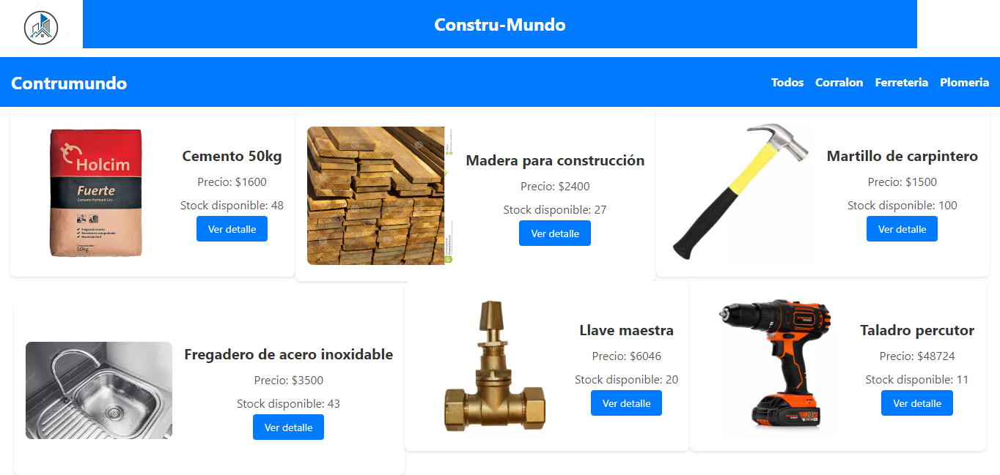
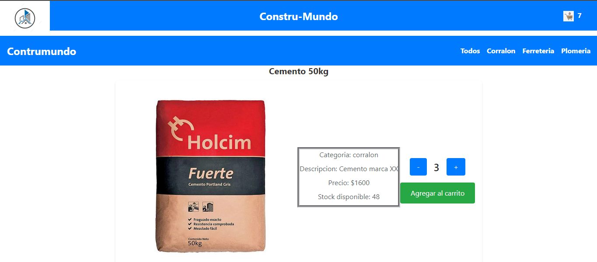
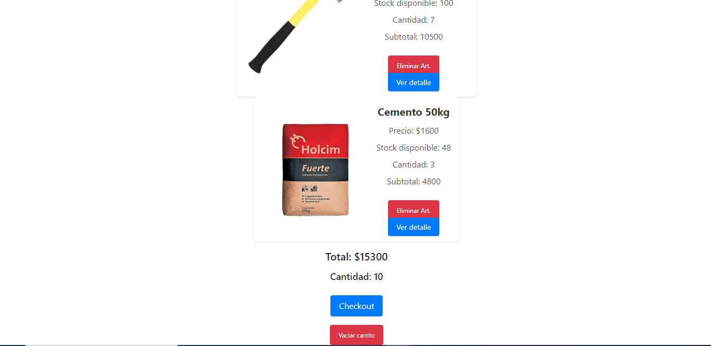
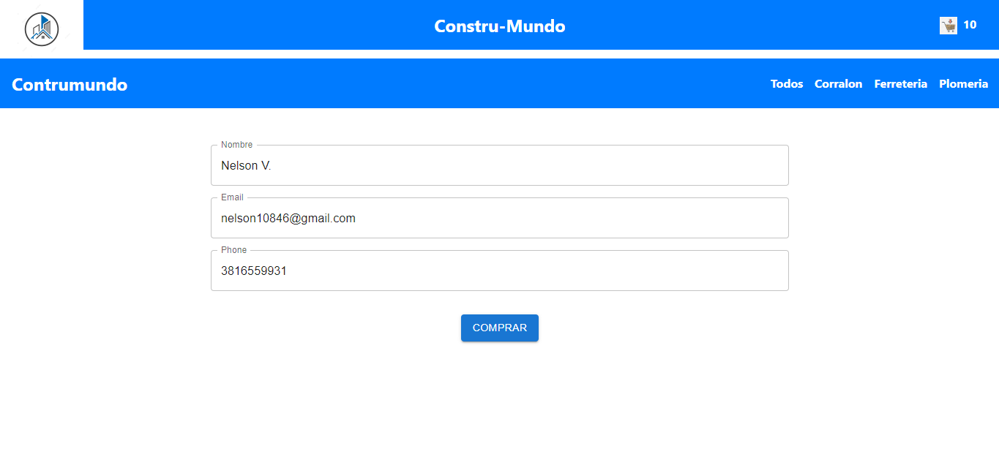
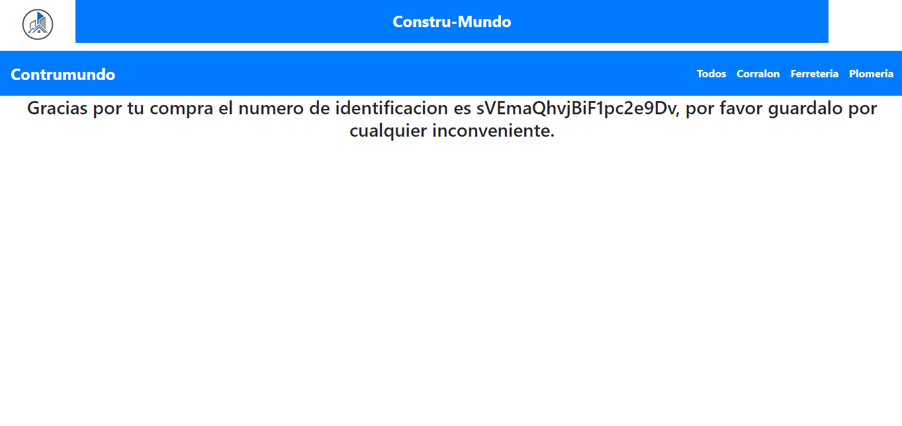
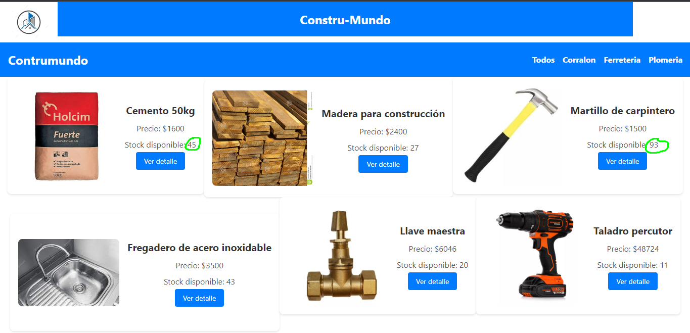

# Construmundo


Bienvenido al proyecto "Construmundo", un e-commerce desarrollado con React.js y Firebase.

## Descripción

Construmundo es una plataforma de comercio electrónico que ofrece una amplia variedad de productos relacionados con la construcción, ferretería y plomería. Permite a los usuarios explorar, buscar y comprar productos de manera fácil y conveniente.

## Capturas de Pantalla








## Demostración

Aquí tienes una breve demostración de cómo funciona la aplicación:


## Características

- Muestra una lista de productos disponibles para la compra.
- Permite agregar productos al carrito de compras.
- Permite ver el detalle de un producto específico.
- Permite realizar la compra y finalizar el proceso de checkout.

## Instalación

Sigue los pasos a continuación para instalar y ejecutar el proyecto en tu entorno local.

### Requisitos previos

Asegúrate de tener instalado Node.js en tu máquina.

### Pasos de instalación

1. Clona el repositorio de GitHub:

   ```Github
   git clone https://github.com/NelsonVsqz/coderappnv.git

   ```

2. Ve al directorio del proyecto:

   ```Node
   cd construmundo

   ```

3. Instala las dependencias del proyecto:

   ```Node
   npm install

   ```

4. Crea un archivo .env en la raíz del proyecto y configura las variables de entorno necesarias. Asegúrate de incluir las siguientes variables:

   ```Node
   REACT_APP_API_KEY=xxx
   REACT_APP_AUTH_DOMAIN=xx.firebaseapp.com
   REACT_APP_PROJECT_ID=xx-dxxx
   REACT_APP_STORAGE_BUCKET=xxx-xx.appspot.com
   REACT_APP_MESSAGING_SENDER_ID=xxxx
   REACT_APP_APP_ID=1:xxx:web:xxxxxxxxxxx
   ```

Reemplaza los valores xxx con los correspondientes a tu proyecto de Firebase.

5. Inicia el servidor de desarrollo:

   ```Node
   npm start

   ```

6. Abre tu navegador web y visita la URL http://localhost:3000 para ver la aplicación en funcionamiento.

## Dependencias

A continuación se muestra la lista de dependencias utilizadas en este proyecto:

    ```Node
    "@emotion/react": "^11.10.6",
    "@emotion/styled": "^11.10.6",
    "@fontsource/roboto": "^4.5.8",
    "@mui/icons-material": "^5.11.11",
    "@mui/material": "^5.11.15",
    "@testing-library/jest-dom": "^5.16.5",
    "@testing-library/react": "^13.4.0",
    "@testing-library/user-event": "^13.5.0",
    "bootstrap": "^5.2.3",
    "dotenv": "^16.0.3",
    "firebase": "^9.22.0",
    "formik": "^2.2.9",
    "react": "^18.2.0",
    "react-bootstrap": "^2.7.2",
    "react-dom": "^18.2.0",
    "react-router-dom": "^6.10.0",
    "react-scripts": "5.0.1",
    "web-vitals": "^2.1.4",
    "yup": "^1.1.1"

## Contribución

Si deseas contribuir a este proyecto, sigue los pasos a continuación:

1. Haz un fork de este repositorio.
2. Crea una nueva rama para tu función o corrección de errores: git checkout -b feature/feature-name o git checkout -b bugfix/bug-name.
3. Realiza los cambios necesarios y haz commit de tus cambios: git commit -m "Descripción de los cambios".
4. Haz push a la rama creada en tu repositorio: git push origin feature/feature-name.
5. Abre un pull request en este repositorio y describe tus cambios en detalle.

## Licencia

Este proyecto se encuentra bajo la licencia MIT.

## Contacto

Para obtener más información, puedes contactarnos en nelson10846@gmail.com.
